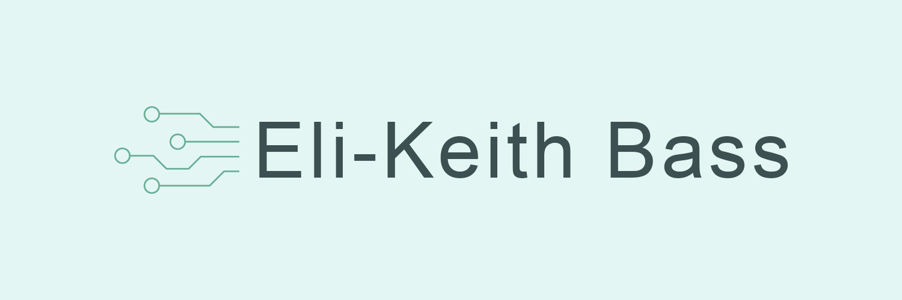

    

 

<h3 align="center">Hi! I'm Eli, a software engineer experienced in full-stack web developement and app developement.</h3>

    
      
    

 

Long time learner and community taught software engineer with a deep interest in automation. Familiar with a wide range of languages and frameworks including HTML, CSS, JavaScript, Node.js, React, MongoDB, C#, Java, and more. Currently designing and programming puzzles for fellow creative minds at escape room companies!

 

<!-- TOOLS -->
<h2 align="center">My Toolbelt</h2>

<table align="center"><tr><td>
    

        
        
HTML

    

</td>
<td>
    

        
        
CSS

    

</td>
<td>
    

        
        
JavaScript

    

<td>
    

        
        
React

    

<td>
    

        
        
Node.js

    

<!-- Second Row -->
<tr>
<td>
    

        
        
C#

    

<td>
    

        
        
C++

    

<td>
    

        
        
Java

    
    
<td>
    

        
        
MongoDB

    

<td>
    

        
        
Git

    

</td></tr></table>